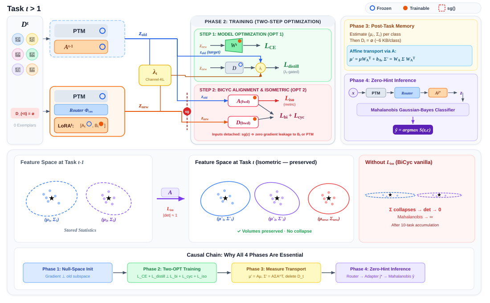

# BiCyc Multi-Adapter: Exemplar-Free Class-Incremental Learning (EFCIL)

Hệ thống mã nguồn và khung thực nghiệm nghiên cứu bài toán **Học tăng cường theo lớp không lưu mẫu (Exemplar-Free Class-Incremental Learning - EFCIL)** trên mô hình thị giác nền tảng **Vision Transformer (ViT)** đóng băng.

Dự án phát triển kiến trúc lai **`keeplora_bicyc`**: Kết hợp **KeepLoRA** ngân hàng đa adapter, định tuyến phân phối đặc trưng đại diện (**PFD Router**), căn chỉnh phân phối hai chiều (**BiCyc**), cùng hai đóng góp lý thuyết mới: **Cổng phân phối thích ứng theo kênh (Channel-wise KL Gate)** và **Ràng buộc bảo toàn đẳng cự (Isometric Regularizer)**.

---

## 1. Tổng Quan Hướng Nghiên Cứu

### 1.1. Bối Cảnh & Thách Thức
* **Bài toán**: Huấn luyện tuần tự $T$ tác vụ phân loại lớp mới (chuẩn benchmark 10 tasks CIFAR-100, mỗi task 10 lớp phân biệt).
* **Ràng buộc khắt khe**: **Tuyệt đối không lưu trữ bất kỳ ảnh mẫu cũ nào ($0$ exemplars)** nhằm tuân thủ quyền riêng tư (GDPR) và tiết kiệm bộ nhớ phần cứng.
* **Mục tiêu**: Giải quyết triệt để nghịch lý giữa bảo tồn tri thức cũ (*Stability*) và tiếp thu khái niệm mới (*Plasticity*), loại bỏ hiện tượng *quên thảm họa (catastrophic forgetting)*.

### 1.2. Các Đóng Góp Cốt Lõi & Tính Mới Khoa Học
1. **⭐ [Đóng góp Mới 1] Vector Channel-wise Gaussian-KL Adaptive Gate ($\vec{\lambda}_{t,i}$)**: Tính toán phân kỳ KL đối xứng trên từng kênh trong số 768 kênh của ViT. Kênh lưu giữ ngữ nghĩa chung được siết chặt chưng cất ($\lambda \to 1.0$), kênh tiếp nhận tri thức mới được nới lỏng ($\lambda \to 0.35$), giải quyết triệt để vấn đề underfitting kênh của BiCyc gốc.
2. **⭐ [Đóng góp Mới 2] Ràng Buộc Đẳng Cự Isometric ($L_{iso}$)**: Ngăn chặn ánh xạ Affine $W_A$ làm co sụp định thức $|\det(W_A)| \to 0$ và biến dạng góc vector đặc trưng, bảo toàn thể tích siêu elip phân phối qua chuỗi dài 10 tasks.
3. **⭐ [Đóng góp Mới 3] Rào Cản Cách Ly Hai Bộ Tối Ưu (Two-Optimizer Gradient Barrier)**: Sử dụng toán tử `detach()` phân lập tuyệt đối: *Model Step* (cập nhật LoRA Up-matrix $B_t$ và Head) và *Alignment Step* (cập nhật mạng căn chỉnh hai chiều $A, D$). Triệt tiêu $100\%$ xung đột gradient giữa thích ứng lớp mới và giữ tri thức cũ.
4. **Ngân Hàng Đa Adapter Độc Lập & Định Tuyến PFD (Cosine Router)**: Kế thừa cơ chế khởi tạo Null-Space SVD từ KeepLoRA, duy trì các adapter riêng biệt theo từng task (không gộp đè làm loãng tri thức). Khi suy diễn, tự động kích hoạt adapter tối ưu nhất theo cơ chế Hard Top-1.
5. **Vận Chuyển Phân Phối Giải Tích & Phân Loại Bayes Không Cần Task-ID**: Lưu trữ thống kê lớp dưới dạng phân phối Gauss $(\mu_c, \Sigma_c)$ siêu nhẹ (~6.2KB/lớp). Vận chuyển tức thì qua công thức giải tích $O(1)$ khi sang task mới; phân loại bằng khoảng cách Mahalanobis khử hoàn toàn thiên vị lớp mới (Recency Bias).

---

## 2. Kiến Trúc Hệ Thống & Các Giai Đoạn Vận Hành

### 2.1. Sơ Đồ Kiến Trúc Tổng Thể (Master End-to-End Architecture)
Toàn bộ chu trình từ luồng dữ liệu, trích xuất đặc trưng, cổng KL thích ứng, rào cản 2 optimizer đến suy luận Bayes được tích hợp trong một sơ đồ thống nhất:

<p align="center">
  
</p>

---

### 2.2. Chi Tiết 4 Giai Đoạn Vận Hành Khép Kín:

#### Giai Đoạn 1: Chiếu Gradient Null-Space & Khởi Tạo KeepLoRA
Gradient tác vụ mới được chiếu qua phần bù trực chuẩn để không làm thay đổi các hướng kích hoạt quan trọng của tác vụ cũ. Khởi tạo $A_t, B_t^{(0)}$ sao cho độ lệch trọng số ban đầu triệt tiêu hoàn toàn ($\Delta W_t^{(0)} = \mathbf{0}$).

<p align="center">
  
</p>

---

#### Giai Đoạn 2: Huấn Luyện 2-Optimizer & Cổng KL 768 Kênh Thích Ứng
Tách biệt hai luồng tối ưu độc lập bằng rào cản `detach()`. Cổng $\vec{\lambda}_{t,i}$ phân hóa linh hoạt 768 kênh ViT dựa trên độ dịch chuyển phân phối Gaussian-KL, kết hợp hàm phạt đẳng cự $L_{iso}$.

<p align="center">
  
</p>

---

#### Giai Đoạn 3: Tiêu Hủy Dữ Liệu Thô (GDPR) & Vận Chuyển Gauss Giải Tích
Ngay khi hoàn thành task, toàn bộ ảnh thô bị xóa bỏ. Phân phối Gauss $(\mu_c, \Sigma_c)$ của các lớp cũ được vận chuyển giải tích sang tọa độ mới qua ánh xạ Affine $A$ mà không cần sinh ảnh mẫu giả.

<p align="center">
  
</p>

---

#### Giai Đoạn 4: Định Tuyến Zero-Hint Cosine Router & Phân Loại Mahalanobis
Khi thử nghiệm mẫu ảnh bất kỳ (không cung cấp Task-ID), Cosine Router tìm adapter có độ tương đồng phân phối cao nhất. Vector đặc trưng được chấm điểm log-likelihood trên toàn bộ các lớp qua khoảng cách Mahalanobis elip.

<p align="center">
  
</p>

> 🔗 **Hệ Thống Tài Liệu Chuyên Sâu Của Đề Tài:**
> * [**Sơ Đồ Vector Kiến Trúc Tổng Thể (overall_architecture.svg)**](docs/figures/overall_architecture.svg) *(Trọng tâm kiến trúc)*
> * [**Báo Cáo Chi Tiết Về Luồng Hoạt Động & Công Thức Toán (WORKFLOW_EXPLAINED.md)**](docs/WORKFLOW_EXPLAINED.md) *(Khuyên đọc)*
> * [**Kiến Trúc Hệ Thống & Ranh Giới Gradient (ARCHITECTURE.md)**](docs/ARCHITECTURE.md)
> * [**Đặc Tả Toán Học Chi Tiết & Ràng Buộc Đẳng Cự (DIRECTION1_SPEC.md)**](docs/DIRECTION1_SPEC.md)
> * [**Trang Trình Chiếu Báo Cáo Slide Động 12 Trang (presentation_slides.html)**](docs/presentation_slides.html)

---

## 3. Cài Đặt Môi Trường

### Yêu cầu phần cứng & phần mềm:
* **Python**: 3.11 hoặc 3.12
* **Phần cứng**: GPU NVIDIA $\ge$ 8 GB VRAM (RTX 3060, 4060, 4070... hoặc T4/P100 trên Cloud). Có hỗ trợ chạy CPU để kiểm thử logic.
* **CUDA**: Khuyến nghị CUDA $\ge$ 12.4.

### Các bước cài đặt:

```bash
# 1. Khởi tạo và kích hoạt môi trường ảo
# Trên Windows (PowerShell):
python -m venv .venv
.venv\Scripts\Activate.ps1

# Trên Linux / macOS:
# python3 -m venv .venv && source .venv/bin/activate

# 2. Cài đặt PyTorch & Torchvision (CUDA 12.4)
pip install torch==2.5.1 torchvision==0.20.1 --index-url https://download.pytorch.org/whl/cu124
# (Nếu chỉ dùng CPU: pip install torch==2.5.1 torchvision==0.20.1 --index-url https://download.pytorch.org/whl/cpu)

# 3. Cài đặt các thư viện phụ thuộc và mã nguồn dự án
pip install -r requirements/base.txt
pip install -e .
```

---

## 4. Khởi Tạo & Chạy Thực Nghiệm

### 4.1. Kiểm Tra Nhanh Hệ Thống (Smoke Test - 3 giây)
Kiểm tra toàn bộ luồng thuật toán (SVD gradient, chiếu QR, 2-optimizer, kênh KL gate, vận chuyển Gauss) mà không cần tải dữ liệu và không cần GPU:
```bash
python scripts/smoke_direction1.py
```
> Kết quả chuẩn: `SMOKE TEST OK`

---

### 4.2. Huấn Luyện Toàn Bộ Pipeline 10 Tasks (CIFAR-100)
*(Dữ liệu benchmark CIFAR-100 được tự động tải về thư mục `data/cifar100/` trong lần chạy đầu tiên).*

#### A. Chạy Thử 1 Epoch/Task (Kiểm tra VRAM & pipeline):
```powershell
python -m bicyc_multiadapter.train experiment=keeplora_bicyc_8gb experiment.train.epochs_per_task=1 experiment.train.batch_size=16
```

#### B. Chạy Đầy Đủ Phương Pháp Đề Xuất (Proposed: Multi-Adapter + BiCyc + Channel Gate + $L_{iso}$):
```powershell
# Khuyến nghị trên Kaggle / GPU 16 GB (T4/P100) - Tối ưu ~1.8h – 2.0h:
python -m bicyc_multiadapter.train experiment=keeplora_bicyc_fast

# Dành cho GPU 8 GB VRAM (RTX 3060/4060/Laptop):
python -m bicyc_multiadapter.train experiment=keeplora_bicyc_8gb

# Dành cho GPU lớn (>= 24 GB VRAM - Batch size 128, SVD full-pass):
python -m bicyc_multiadapter.train experiment=keeplora_bicyc
```

#### C. Chạy Mô Hình Đối Chứng (Baseline KeepLoRA Gốc - Gộp adapter, không căn chỉnh BiCyc):
```powershell
# Chạy baseline KeepLoRA phục vụ bảng so sánh (Ablation Study):
python -m bicyc_multiadapter.train experiment=keeplora_original
```

#### D. Chạy Các Thử Nghiệm Triệt Tiêu (Ablation Studies):
```powershell
# 1. Dùng cổng vô hướng (Scalar Adaptive Gate):
python -m bicyc_multiadapter.train experiment=keeplora_bicyc_fast experiment.alignment.channelwise_gate=false

# 2. Không dùng cổng thích ứng (Cố định lambda = 1.0):
python -m bicyc_multiadapter.train experiment=keeplora_bicyc_fast experiment.alignment.adaptive_gate=false

# 3. Không dùng ràng buộc đẳng cự (L_iso = 0):
python -m bicyc_multiadapter.train experiment=keeplora_bicyc_fast experiment.alignment.lambda_iso=0.0
```

---

### 4.3. Cơ Chế Tự Động Khôi Phục (Auto Resume)
Hệ thống tự động ghi nhớ trạng thái huấn luyện:
* `checkpoint_boundary.pt`: Tự động lưu khi vừa kết thúc một task.
* `checkpoint_live.pt`: Tự động lưu từng epoch và trạng thái optimizer.

Nếu quá trình huấn luyện bị gián đoạn (mất điện, ngắt kết nối Cloud, `Ctrl+C`), **chỉ cần chạy lại chính xác câu lệnh trước đó**, mã nguồn sẽ tự động phát hiện và huấn luyện tiếp từ điểm dừng.

---

### 4.4. Theo Dõi & Đánh Giá Kết Quả

* **Mở bảng điều khiển trực quan hóa TensorBoard:**
  ```bash
  tensorboard --logdir outputs
  ```
* **Đánh giá lại mô hình từ checkpoint đã lưu:**
  ```powershell
  python -m bicyc_multiadapter.evaluate experiment=keeplora_bicyc_fast
  ```
* **Vị trí lưu trữ dữ liệu thực nghiệm:**
  Ma trận độ chính xác $10 \times 10$, mức độ quên trung bình (*average forgetting*), độ trôi biểu diễn (*representation drift*) được ghi tự động tại:
  `outputs/<tên_thí_nghiệm>/seed_<seed>/` (gồm `history.jsonl`, `train_log.csv`, và `run.log`).

---

### 4.5. Triển Khai trên Cloud (Kaggle / Colab)
Sử dụng trực tiếp các notebook đã cấu hình sẵn trong thư mục `notebooks/`:
* **Kaggle Notebook**: [`notebooks/kaggle_train.ipynb`](notebooks/kaggle_train.ipynb) — Tối ưu hóa cho GPU T4/P100 16GB, tự động kích hoạt `keeplora_bicyc_fast`, nạp dataset CIFAR-100 không cần Internet và đóng gói `results.zip`.
* **Google Colab Notebook**: [`notebooks/colab_train.ipynb`](notebooks/colab_train.ipynb) — Tích hợp kết nối Google Drive tự động sao lưu checkpoint để chống mất kết nối giữa chừng.
