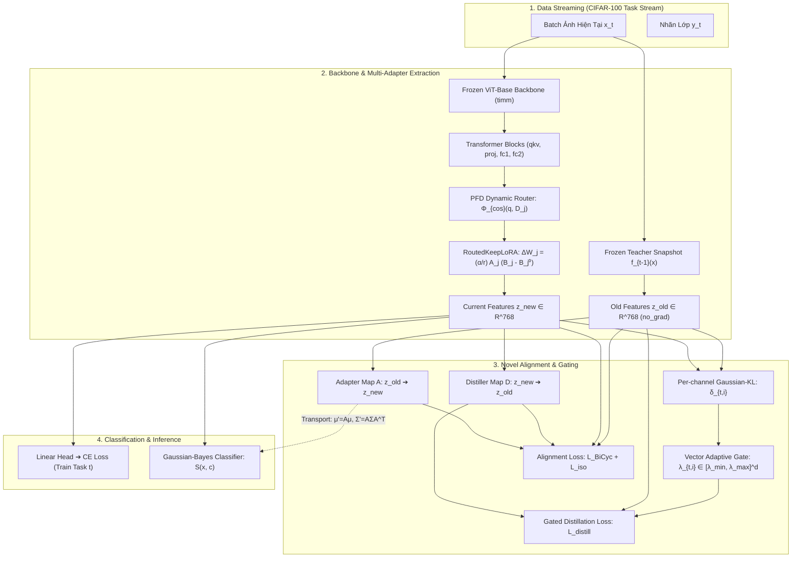
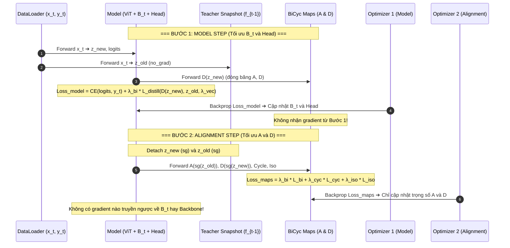

# Kiến trúc Hệ thống & Sơ đồ Luồng Hoạt động (Architecture)

Tài liệu này mô tả chi tiết kiến trúc phần mềm, dòng chảy dữ liệu (dataflow) và cơ chế cô lập gradient (gradient barrier) cho toàn bộ hệ thống thí nghiệm **BiCyc Multi-Adapter**.

---

## 1. Sơ đồ Luồng Dữ liệu Tổng thể (End-to-End Dataflow)

---

## 2. Ranh giới Gradient & Cơ chế 2 Optimizer

Hệ thống bắt buộc tuân thủ nguyên tắc **Cách ly Gradient Tuyệt đối** để vừa bảo tồn tri thức cũ vừa không làm suy giảm khả năng học mới (*Plasticity*):

---

## 3. Vòng đời Huấn luyện một Task CIL (`DirectionOneExperiment`)

Mỗi task $t \in \{0, \dots, T-1\}$ trải qua 6 giai đoạn có kiểm soát chặt chẽ:

1. **`expand_head`**:
   Mở rộng thêm số hàng trong `nn.Linear` classifier tương ứng với các class mới của task $t$. Các hàng của class cũ được giữ nguyên trọng số.
2. **`begin_task`**:
   * Chạy 1 lượt phân loại ban đầu trên toàn bộ stream dữ liệu của task $t$ để tích lũy ma trận gradient $G_t$.
   * Chiếu trực giao gradient $\hat{G}_t = (I - Q_{t-1}Q_{t-1}^\top) G_t$.
   * Phân tích SVD để khởi tạo $(A_t, B_t^{(0)})$, đóng băng $A_t$ và kích hoạt $B_t$.
   * Gắn forward hooks thu thập kích hoạt đầu vào của 48 target linears (cache trên RAM CPU).
3. **`train_epochs`**:
   * Chạy vòng lặp huấn luyện theo cơ chế 2-Optimizer (`KeepLoRATrainer.train_batch`).
   * Cập nhật vector kỳ vọng trực tuyến $\mathcal{D}_t^l = \mathbb{E}[W^l h^l(x)]$ cho PFD router sau mỗi batch.
4. **`Consolidation`**:
   * Chạy 1 lượt forward qua train set để trích xuất đặc trưng $z_{new}$.
   * Nếu $t > 0$: Vận chuyển thống kê của toàn bộ class cũ qua mạng $A$:
     $$\mu'_c = \mu_c W_A^\top + b_A, \qquad \Sigma'_c = W_A \Sigma_c W_A^\top$$
   * Fit kỳ vọng $\mu_c$ và hiệp phương sai $\Sigma_c$ cho các class mới của task $t$.
5. **`end_task`**:
   * Trích xuất các hướng kích hoạt dư từ cache, phân tích SVD để cập nhật Feature Memory $M_t = \operatorname{orth}([M_{t-1}, U_{t, 1:m}])$.
   * Đóng băng hoàn toàn ma trận $B_t$.
6. **`snapshot` & `_evaluate_upto`**:
   * Tạo bản sao bất biến (deep-copy snapshot) $f_t$ để làm Teacher cho task $t+1$.
   * Đánh giá ma trận độ chính xác trên toàn bộ test set của các task đã học từ $0 \dots t$.
   * Lưu checkpoint an toàn (rolling atomic save).

