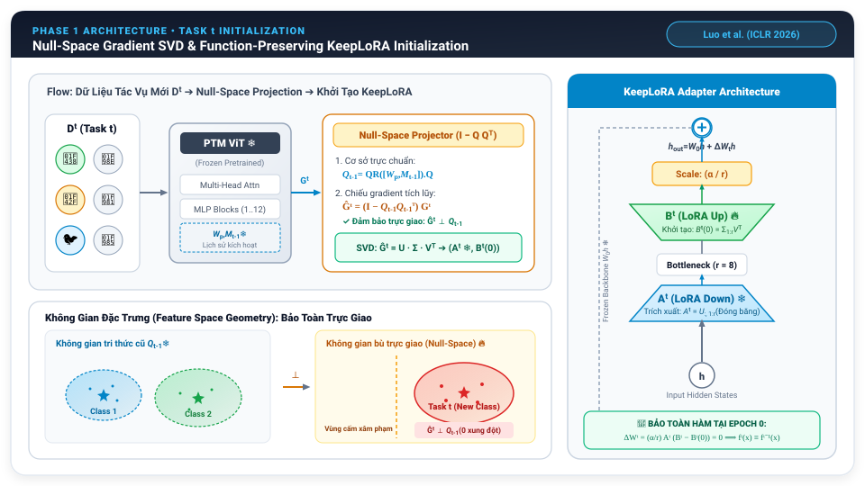
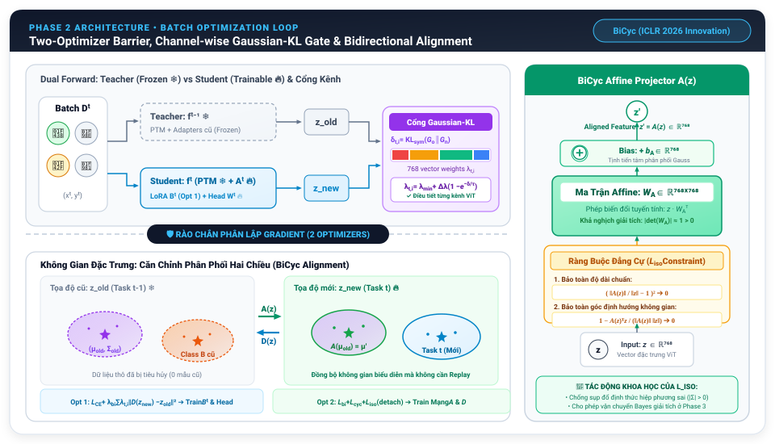
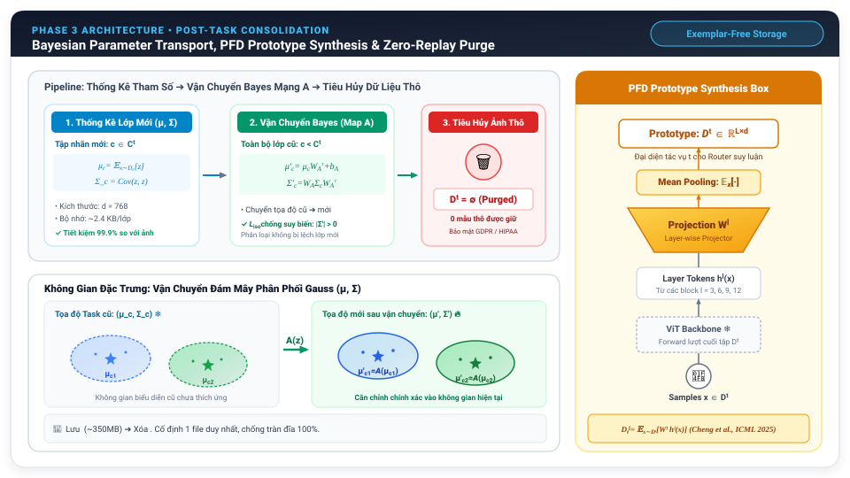
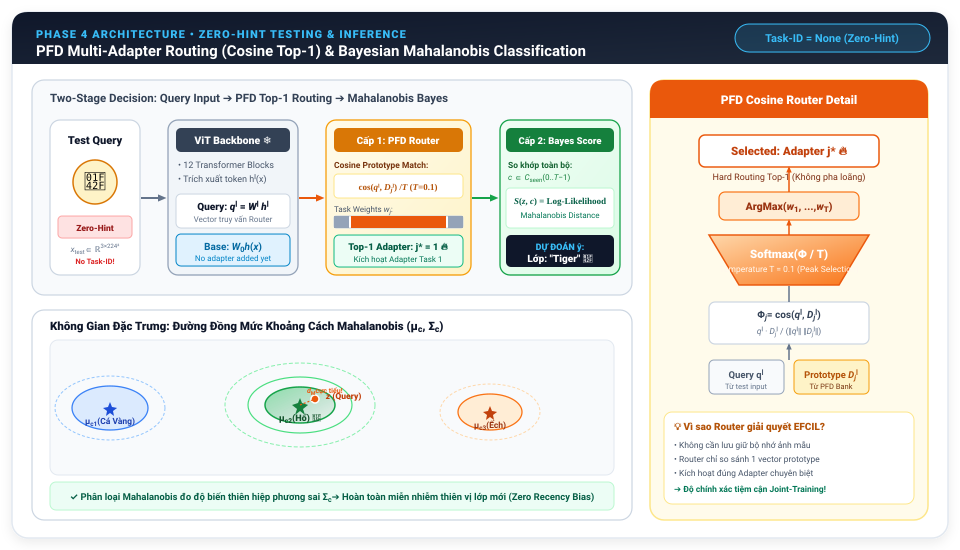

# BẢN GIẢI TRÌNH CHI TIẾT NGUYÊN LÝ & LUỒNG HOẠT ĐỘNG KIẾN TRÚC BICYC MULTI-ADAPTER
### Tài Liệu Nghiên Cứu Chuyên Sâu, Giải Trình Luận Điểm Khoa Học & Báo Cáo Chuyên Môn

---

## MỤC LỤC
1. [Khởi Nguồn Vấn Đề: Tại Sao Bài Toán Này Lại Khó?](#1-khởi-nguồn-vấn-đề-tại-sao-bài-toán-này-lại-khó)
2. [Bản Chất Hình Học & Đại Số Của Sự Quên Thảm Họa (Geometric Breakdown)](#2-bản-chất-hình-học--đại-số-của-sự-quên-thảm-họa)
3. [Triết Lý Cốt Lõi Của Chu Trình 4 Giai Đoạn (Controlled Diffeomorphism)](#3-triết-lý-cốt-lõi-của-chu-trình-4-giai-đoạn)
4. [Bảng Quy Ước Ký Hiệu & Chiều Không Gian Toàn Cục](#4-bảng-quy-ước-ký-hiệu--chiều-không-gian-toàn-cục)
5. [Giai Đoạn 1: Khởi Tạo Tác Vụ Mới (Null-Space SVD Subspace Decoupling)](#5-giai-đoạn-1-khởi-tạo-tác-vụ-mới)
6. [Giai Đoạn 2: Vòng Lặp Huấn Luyện Batch (Two-Optimizer Barrier & Gaussian-KL Gate)](#6-giai-đoạn-2-vòng-lặp-huấn-luyện-batch)
7. [Giai Đoạn 3: Hậu Xử Lý Khi Hoàn Thành Task (Statistical Bayes Measure Transport)](#7-giai-đoạn-3-hậu-xử-lý-khi-hoàn-thành-task)
8. [Giai Đoạn 4: Kiểm Thử & Suy Luận Không Gợi Ý (Two-Tier Zero-Hint Bayesian Inference)](#8-giai-đoạn-4-kiểm-thử--suy-luận-không-gợi-ý)
9. [Bản Tóm Lược Chuỗi Nhân - Quả Cốt Tử Giữa 4 Giai Đoạn](#9-bản-tóm-lược-chuỗi-nhân---quả-cốt-tử-giữa-4-giai-đoạn)
10. [Bảng Tra Cứu Nhanh Các Tham Số & Ký Hiệu Trọng Tâm](#10-bảng-tra-cứu-nhanh-các-tham-số--ký-hiệu-trọng-tâm)
11. [Kịch Bản Bảo Vệ & Trả Lời Câu Hỏi Của Giảng Viên / Hội Đồng](#11-kịch-bản-bảo-vệ--trả-lời-câu-hỏi-của-giảng-viên--hội-đồng)
12. [Bảng Đối Chiếu Mã Nguồn Trong Codebase](#12-bảng-đối-chiếu-mã-nguồn-trong-codebase)

---

## 1. KHỞI NGUỒN VẤN ĐỀ: TẠI SAO BÀI TOÁN NÀY LẠI KHÓ?

Trong học máy truyền thống, ta giả định toàn bộ dữ liệu của mọi lớp đều có sẵn cùng một lúc để huấn luyện (*Offline / Joint Training*). Tuy nhiên trong thực tế triển khai:
- Dữ liệu xuất hiện theo thời gian dưới dạng chuỗi các tác vụ $t \in \{0, 1, \dots, T-1\}$ (ví dụ: CIFAR-100 chia làm 10 tasks, mỗi task gồm 10 lớp mới hoàn toàn, hoặc ImageNet-R chia 20 tasks).
- **Ràng buộc ngặt nghèo (Exemplar-Free Class-Incremental Learning - EFCIL)**: Khi học xong task $t$, toàn bộ ảnh thô của task đó **bắt buộc phải bị tiêu hủy sạch sẽ**, không được lưu lại bất kỳ mẫu nào ($0\text{ exemplars}, \mathcal{D}_{<t} = \emptyset$). Điều này xuất phát từ:
  1. *Quy định pháp lý & quyền riêng tư*: GDPR (Châu Âu) hay HIPAA (Y tế) nghiêm cấm việc lưu trữ dữ liệu bệnh nhân, khuôn mặt, hồ sơ cá nhân qua thời gian.
  2. *Giới hạn phần cứng*: Thiết bị nhúng (Edge AI, Robot tự hành) không có đủ bộ nhớ để tích lũy hàng gigabyte dữ liệu qua năm tháng.

### Nghịch Lý Muôn Thuở: Stability-Plasticity Dilemma
Khi giải quyết bài toán này, mạng nơ-ron đối mặt với một mâu thuẫn hình học nội tại:
- **Tính mềm dẻo (Plasticity)**: Muốn học được lớp mới, mô hình phải uốn nắn trọng số để tạo ra ranh giới phân tách các lớp mới.
- **Tính bền vững (Stability)**: Nhưng khi trọng số thay đổi, các vector đặc trưng của các lớp cũ đã học trước đó sẽ bị xoay chuyển hoặc sụp đổ hoàn toàn. Hiện tượng này gọi là **Quên Thảm Khốc (Catastrophic Forgetting)**.

---

## 2. BẢN CHẤT HÌNH HỌC & ĐẠI SỐ CỦA SỰ QUÊN THẢM HỌA

Để hiểu tại sao cần 4 giai đoạn, ta phải nhìn vào bản chất toán học sâu xa của sự quên trong không gian vector:

### 2.1. Sự Sụp Đổ Ranh Giới Siêu Phẳng (Hyperplane Collapse)
- Trong không gian đặc trưng $d = 768$ của Vision Transformer, mỗi lớp dữ liệu là một **đám mây điểm**.
- Khi học Task 0, mạng tối ưu trọng số $W$ để tạo ra các siêu phẳng phân tách lớp Task 0.
- Khi sang Task 1, dữ liệu Task 0 bị xóa sạch. Hàm mất mát phân loại $\mathcal{L}_{CE}$ chỉ quan tâm kéo các đám mây Task 1 ra xa nhau. Vô tình, ma trận $W$ bị xoay đi một góc lớn. Các đám mây của Task 0 trước đó bị **chiếu chồng lấn lên nhau (feature collapse)**, khiến ranh giới quyết định cũ hoàn toàn tan rã.

### 2.2. Nghịch Lý "Giữ Hay Xoay" (The Rigid-Body Dilemma)
Hầu hết các nghiên cứu trước đây rơi vào 3 cái bẫy:
1. **Nếu đóng băng mô hình (Frozen Backbone)**: Giữ được nguyên vẹn không gian cũ, nhưng mô hình mất hoàn toàn tính mềm dẻo, không thể học tốt các lớp mới khó (*Plasticity Underfitting*).
2. **Nếu cho phép cập nhật (Fine-tuning / LoRA thông thường)**: Mô hình học rất nhanh lớp mới, nhưng gradient tự do của task mới đè bẹp các hướng biểu diễn cũ, độ chính xác lớp cũ rơi tự do từ $90\%$ xuống dưới $10\%$ (*Catastrophic Drift*).
3. **Nếu chưng cất tri thức cổ điển (Vanilla KD)**: Mạng ép mọi đặc trưng mới phải bám sát mạng cũ qua $\|z_{new} - z_{old}\|^2$. Đây là một **sợi dây xích cứng nhắc**, ngăn cản mạng học đặc trưng mới và gây xung đột nội bộ dữ dội.

---

## 3. TRIẾT LÝ CỐT LÕI CỦA CHU TRÌNH 4 GIAI ĐOẠN

Thay vì kìm kẹp không gian biểu diễn bằng sợi dây xích cứng, **BiCyc Multi-Adapter** cho phép không gian **biến dạng có kiểm soát (Controlled Diffeomorphism)** qua 4 mắt xích nhân - quả hoàn chỉnh:

```
[ GIAI ĐOẠN 1: KHỞI TẠO ]       Bản chất: PHÂN TÁCH KHÔNG GIAN CON (Subspace Decoupling)
         │                       Triệt tiêu 100% xung đột đại số: Q_{t-1}^T * \hat{G}_t = 0
         ▼
[ GIAI ĐOẠN 2: BATCH LOOP ]     Bản chất: PHÂN LẬP ĐỘNG LỰC HỌC & CO GIÃN THEO TRỤC
         │                       Tách 2 Optimizer đối lập + Cổng KL thích nghi 768 chiều
         ▼
[ GIAI ĐOẠN 3: HẬU XỬ LÝ ]      Bản chất: VẬN CHUYỂN THỐNG KÊ (Statistical Measure Transport)
         │                       Lưu phân phối Gauss (μ, Σ) + Đẩy tọa độ cũ qua ma trận Affine A
         ▼
[ GIAI ĐOẠN 4: SUY LUẬN ]       Bản chất: SUY DIỄN BAYES HAI CẤP (Two-Tier Bayesian Decision)
                                 Định tuyến Top-1 cứng + Khoảng cách Mahalanobis khử Recency Bias
```

---

## 4. BẢNG QUY ƯỚC KÝ HIỆU & CHIỀU KHÔNG GIAN TOÀN CỤC

Để dễ đọc và theo dõi mạch lạc, toàn bộ tài liệu tuân thủ nghiêm ngặt quy chuẩn ký hiệu toán học sau:
- **Chữ in hoa in đậm / hoa ($W, Q, G, U, \Sigma, V, A_t, B_t$):** Đại diện cho **Ma trận (Matrix)**.
- **Chữ in thường ($x, h, z, q, \mu, b$):** Đại diện cho **Vector**.
- **Chữ Hy Lạp hoặc chữ thường in nghiêng ($\lambda, \tau, \alpha, r, \gamma, T$):** Đại diện cho **Đại lượng vô hướng (Scalar)** hoặc **Siêu tham số**.
- **Các chiều không gian mặc định trong Vision Transformer (ViT-B/16):**
  - $d = 768$: Số chiều vector đặc trưng ẩn của ViT.
  - $r = 8$: Hạng rút gọn (Rank) của Bottleneck Adapter (LoRA).
  - $L = 4$: Số tầng trích xuất token cho Router (các Transformer blocks thứ $3, 6, 9, 12$).
  - $T$: Tổng số tác vụ liên tiếp ($t \in \{0, 1, \dots, T-1\}$).

---

## 5. GIAI ĐOẠN 1: KHỞI TẠO TÁC VỤ MỚI
*(Null-Space SVD Subspace Decoupling & KeepLoRA Initialization)*



```
    Dữ liệu mới Dᵗ
         │
         ▼
 ┌───────────────┐        Gradient Gᵗ        ┌─────────────────────────────┐
 │    PTM ViT    │ ────────────────────────► │ Null-Space Projector        │
 │  Backbone ❄️  │                           │ Ĝᵗ = (I - Q_{t-1} Q_{t-1}ᵀ) Gᵗ │
 └───────────────┘                           └──────────────┬──────────────┘
   (Frozen W_0)                                             │ SVD: Ĝᵗ = U Σ Vᵀ
                                                            ▼
                                             ┌─────────────────────────────┐
                                             │ KeepLoRA Adapter t          │
                                             │ • Aᵗ = U_{:,1:r} (Frozen ❄️) │
                                             │ • Bᵗ(0) = Σ_{1:r} Vᵀ (Train)│
                                             └─────────────────────────────┘
```

### 5.1. Xây dựng ma trận cơ sở bảo vệ không gian cũ ($Q_{t-1}$)
$$Q_{t-1} = \operatorname{QR}([W_p, M_{t-1}]).Q \in \mathbb{R}^{d_{in} \times (p+m)}$$

* **Bóc tách chi tiết từng thành phần:**
  * $W_p \in \mathbb{R}^{d_{in} \times p}$: **Ma trận** chứa $p$ hướng biểu diễn quan trọng của trọng số mạng trước đó.
  * $M_{t-1} \in \mathbb{R}^{d_{in} \times m}$: **Ma trận** lưu các vector kích hoạt lịch sử (activation cache) của các task cũ.
  * $[W_p, M_{t-1}]$: Phép ghép ngang hai ma trận thành kích thước $d_{in} \times (p+m)$.
  * $\operatorname{QR}(\cdot).Q$: Phân tích trực giao QR, trích xuất ma trận trực chuẩn $Q$.
  * $Q_{t-1} \in \mathbb{R}^{d_{in} \times (p+m)}$: **Ma trận cơ sở trực chuẩn**, thỏa mãn tính chất $Q_{t-1}^\top Q_{t-1} = I$ (Ma trận đơn vị). Nó đóng vai trò như **"bức tường thành"** bao bọc toàn bộ tri thức của các tác vụ từ $0$ đến $t-1$.

---

### 5.2. Phân rã đại số & Chiếu Gradient vào Không Gian Hạch (Null-Space)
$$G_t = G_\parallel + G_\perp$$
$$\hat{G}_t = (I - Q_{t-1} Q_{t-1}^\top) G_t$$

* **Bóc tách chi tiết từng thành phần:**
  * $G_t \in \mathbb{R}^{d_{out} \times d_{in}}$: **Ma trận gradient tích lũy** của task mới tính trên hàm mất mát phân loại.
  * $G_\parallel = Q_{t-1} Q_{t-1}^\top G_t$: Thành phần gradient chiếu **thẳng góc vào không gian cũ**. *Đây chính là thủ phạm xóa sổ ký ức cũ nếu dùng LoRA thường!*
  * $I \in \mathbb{R}^{d_{in} \times d_{in}}$: Ma trận đơn vị.
  * $(I - Q_{t-1} Q_{t-1}^\top)$: **Toán tử chiếu trực giao** ra không gian bù (Null-Space Projection Matrix).
  * $\hat{G}_t \in \mathbb{R}^{d_{out} \times d_{in}}$: **Ma trận gradient dư** sau khi đã loại bỏ hoàn toàn $G_\parallel$.
* **Chứng minh toán học triệt tiêu xung đột ($100\%$ không gây nhiễu):**
  $$Q_{t-1}^\top \hat{G}_t = Q_{t-1}^\top (I - Q_{t-1} Q_{t-1}^\top) G_t = (Q_{t-1}^\top - \underbrace{Q_{t-1}^\top Q_{t-1}}_{= I} Q_{t-1}^\top) G_t = (Q_{t-1}^\top - Q_{t-1}^\top) G_t = \mathbf{0}$$
  $\implies \hat{G}_t \perp Q_{t-1}$: Task mới được bảo đảm toán học là chỉ học trong những chiều không gian mà task cũ chưa từng chạm đến!

---

### 5.3. Phân rã phổ SVD & Khởi tạo bảo toàn hàm (Function-Preserving)
$$\hat{G}_t = U \Sigma V^\top$$
$$A_t = U_{:, 1:r} \in \mathbb{R}^{d_{in} \times r} \quad (\text{Đóng băng vĩnh viễn ❄️}), \qquad B_t^{(0)} = \Sigma_{1:r} V_{:, 1:r}^\top \in \mathbb{R}^{r \times d_{out}} \quad (\text{Khởi tạo})$$
$$\Delta W_t = \frac{\alpha}{r} A_t (B_t - B_t^{(0)})$$

* **Bóc tách chi tiết từng thành phần:**
  * $\hat{G}_t = U \Sigma V^\top$: Phân tích giá trị kỳ dị (SVD) của ma trận gradient dư.
  * $\Sigma_{1:r} \in \mathbb{R}^{r \times r}$: **Ma trận đường chéo** chứa $r$ giá trị kỳ dị lớn nhất, đại diện cho **$r$ hướng biến thiên năng lượng mạnh nhất** của task mới.
  * $A_t \in \mathbb{R}^{d_{in} \times r}$: **Ma trận chiếu xuống (Down-projection)**, giữ cố định 100% suốt quá trình học để khóa cứng không gian con trực giao.
  * $B_t \in \mathbb{R}^{r \times d_{out}}$: **Ma trận chiếu lên (Up-projection)**, là thành phần tham số **duy nhất được tối ưu hóa** bằng gradient.
  * $B_t^{(0)}$: Giá trị khởi tạo của ma trận $B_t$ tại epoch 0.
  * $\alpha / r$: Hệ số co giãn vô hướng của LoRA (mặc định $\alpha = 16, r = 8 \implies \text{scale} = 2.0$).
* **Định lý bảo toàn hàm tại Epoch 0 (Zero Initial Perturbation):**
  $$\text{Tại thời điểm bắt đầu } (B_t = B_t^{(0)}): \quad \Delta W_t^{(0)} = \frac{\alpha}{r} A_t (B_t^{(0)} - B_t^{(0)}) = \frac{\alpha}{r} A_t (\mathbf{0}) = \mathbf{0}$$
  $$\implies f_t^{(0)}(x) = W_0 h(x) + \Delta W_t^{(0)} h(x) = W_0 h(x) \equiv f_{t-1}(x)$$
  Mô hình bước vào task mới với hành vi y hệt mô hình cũ, **xóa bỏ triệt để hiện tượng biến dạng trọng số đột ngột**.

---

## 6. GIAI ĐOẠN 2: VÒNG LẶP HUẤN LUYỆN BATCH
*(Two-Optimizer Barrier, Channel-wise Gaussian-KL Gate & Isometric Regularization)*



### 6.1. Rào cản Hai Bộ Tối Ưu (Two-Optimizer Barrier)
Tại sao không thể dùng 1 Optimizer gộp chung?
* $\nabla_{B_t} \mathcal{L}_{CE}$: Lực kéo dãn biểu diễn $z_{new}$ để phân tách các lớp mới.
* $\nabla_{B_t} \mathcal{L}_{bi}$: Lực níu giữ kéo $D(z_{new})$ bám chặt về $z_{old}$.
* *Hậu quả:* Hai lực này **ngược chiều nhau** ($\nabla \mathcal{L}_{CE} \cdot \nabla \mathcal{L}_{bi} < 0$). Nếu train chung 1 optimizer, chúng triệt tiêu nhau khiến mô hình bị tê liệt. Do đó phải tách làm 2 bước độc lập:

#### Bước 1: Model Step (Optimizer 1 - Cập nhật mạng chính)
$$\min_{B_t, \text{Head}} \mathcal{L}_{model} = \mathcal{L}_{CE}(\text{logits}, y) + \lambda_{bi} \sum_{i=1}^{768} \lambda_{t,i} \cdot \|D(z_{new})_i - z_{old,i}\|^2$$

* **Bóc tách chi tiết từng thành phần:**
  * $\mathcal{L}_{CE}$: Hàm mất mát Cross-Entropy chuẩn trên các nhãn lớp mới của task hiện tại.
  * $z_{new} = f_t(x) \in \mathbb{R}^{768}$: **Vector đặc trưng** trích xuất từ mô hình Student hiện tại.
  * $z_{old} = f_{t-1}(x) \in \mathbb{R}^{768}$: **Vector đặc trưng** trích xuất từ Teacher snapshot đóng băng.
  * $D(\cdot)$: **Mạng chiếu lùi (Backward Map)** $D(z) = z W_D^\top + b_D$. Trong bước này, $D$ **bị khóa gradient hoàn toàn**, đóng vai trò như một **cây thước đo chuẩn cố định**.
  * $\lambda_{bi}$: Hệ số vô hướng cân bằng mất mát căn chỉnh (mặc định $\lambda_{bi} = 8.0$).
  * $\lambda_{t,i}$: **Trọng số thích ứng riêng biệt cho chiều thứ $i$** ($i \in \{1, \dots, 768\}$) sinh ra từ Cổng Gaussian-KL.
  * **Tham số được cập nhật:** Duy nhất ma trận $B_t$ của LoRA và các trọng số của Classification Head mới.

#### Bước 2: Alignment Step (Optimizer 2 - Cập nhật thước đo căn chỉnh)
$$\min_{A, D} \mathcal{L}_{maps} = \lambda_{bi} \|A(z_{old}) - z_{new}\|^2 + \lambda_{cyc} \mathcal{L}_{cyc} + \lambda_{iso} \mathcal{L}_{iso} \quad \text{với } z_{new}.\text{detach}(), \ z_{old}.\text{detach}()$$

* **Bóc tách chi tiết từng thành phần:**
  * $z.\text{detach}()$: Phép ngắt dòng đạo hàm ngược trong PyTorch. Hai vector đặc trưng $z_{new}$ và $z_{old}$ được xem như các điểm dữ liệu cố định trong không gian.
  * $A(\cdot)$: **Mạng chiếu tiến (Forward Map)** $A(z) = z W_A^\top + b_A$.
  * $\mathcal{L}_{cyc} = \|D(A(z_{old})) - z_{old}\|^2 + \|A(D(z_{new})) - z_{new}\|^2$: Hàm mất mát chu trình khép kín, ép $A$ và $D$ phải là **hai ánh xạ nghịch đảo của nhau** ($A \approx D^{-1}$).
  * **Tham số được cập nhật:** Duy nhất ma trận trọng số và bias của 2 mạng $A$ và $D$ ($W_A, b_A, W_D, b_D$).

---

### 6.2. Cổng phân kỳ Gaussian-KL theo 768 chiều ($\vec{\lambda}_{t,i}$)
Không thể phạt cào bằng 1 số $\lambda$ vô hướng cho cả 768 kênh, vì có kênh giữ nét bất biến (góc, cạnh) cần giữ chặt, có kênh học ngữ nghĩa riêng cần nới lỏng:
$$\delta_{t,i} = \text{KL}_{sym}(\mathcal{G}_{o,i} \parallel \mathcal{G}_{n,i}) = \frac{1}{2}\left[ \frac{\sigma_{o,i}^2}{\sigma_{n,i}^2} + \frac{\sigma_{n,i}^2}{\sigma_{o,i}^2} + (\mu_{o,i} - \mu_{n,i})^2 \left(\frac{1}{\sigma_{o,i}^2} + \frac{1}{\sigma_{n,i}^2}\right) - 2 \right]$$
$$\lambda_{t,i} = \lambda_{min} + (\lambda_{max} - \lambda_{min})\left(1 - e^{-\delta_{t,i}/\tau}\right)$$

* **Bóc tách chi tiết từng thành phần:**
  * $\mu_{o,i}, \sigma_{o,i}^2$: **Giá trị trung bình** và **phương sai** của kênh thứ $i$ trên mô hình cũ (Teacher).
  * $\mu_{n,i}, \sigma_{n,i}^2$: **Giá trị trung bình** và **phương sai** của kênh thứ $i$ trên mô hình mới (Student).
  * $\delta_{t,i} \ge 0$: **Độ phân kỳ đối xứng Kullback-Leibler** đo mức độ xáo trộn phân phối của kênh $i$.
  * $\tau$: Siêu tham số nhiệt độ điều tiết độ nhạy (mặc định $\tau = 1.0$).
  * $\lambda_{min}, \lambda_{max}$: Ngưỡng phạt chưng cất dưới và trên (ví dụ $0.4$ và $1.0$).
  * **Cơ chế hoạt động:**
    * Kênh biến động mạnh ($\delta_{t,i}$ lớn $\to e^{-\delta/\tau} \to 0$): $\lambda_{t,i} \to \lambda_{max}$ phạt nới lỏng để kênh này thoải mái học lớp mới.
    * Kênh ổn định ($\delta_{t,i} \approx 0$): $\lambda_{t,i} \to \lambda_{min}$ phạt nghiêm ngặt để bảo vệ tri thức nền tảng.

---

### 6.3. Ràng Buộc Đẳng Cự $\mathcal{L}_{iso}$ (Isometric Regularizer)
$$\mathcal{L}_{iso} = \left( \frac{\|A(z)\|}{\|z\|} - 1 \right)^2 + \left( 1 - \frac{A(z)^\top z}{\|A(z)\| \|z\|} \right)$$

* **Bóc tách chi tiết từng thành phần:**
  * $\|z\| = \sqrt{\sum_{i=1}^{768} z_i^2}$: **Chuẩn Euclid (độ dài vector)** của vector $z$.
  * Số hạng thứ nhất $\left( \frac{\|A(z)\|}{\|z\|} - 1 \right)^2$: **Bảo toàn độ dài chuẩn**. Ép tỉ số độ dài trước và sau biến đổi bằng $1$. Ngăn chặn hiện tượng vector bị co rúm lại ($0$) hoặc bùng nổ vô hạn ($\infty$).
  * Số hạng thứ hai $\left( 1 - \frac{A(z)^\top z}{\|A(z)\| \|z\|} \right) = 1 - \cos(A(z), z)$: **Bảo toàn góc xoay định hướng**. Ép góc lệch giữa không gian cũ và mới không bị vặn xoắn quá mức.
  * **Ý nghĩa quyết định:** Giúp ma trận affine $W_A$ thỏa mãn tính chất đẳng cự (Isometry) $\implies |\det(W_A)| \approx 1 > 0$, đảm bảo ma trận hiệp phương sai $\Sigma$ khi vận chuyển ở Giai đoạn 3 **luôn xác định dương và không bị sụp đổ thể tích**.

---

## 7. GIAI ĐOẠN 3: HẬU XỬ LÝ KHI HOÀN THÀNH TASK
*(Statistical Bayes Measure Transport & Zero-Raw Memory)*



### 7.1. Ước lượng phân phối chuẩn lớp mới & Tiêu hủy ảnh thô
$$\mu_c = \mathbb{E}_{x \sim \mathcal{D}_t, y=c}[z] \in \mathbb{R}^{768}$$
$$\Sigma_c = \frac{1}{N_c - 1} \sum_{x \in \mathcal{D}_t, y=c} (z - \mu_c)(z - \mu_c)^\top \in \mathbb{R}^{768 \times 768}$$

* **Bóc tách chi tiết từng thành phần:**
  * $\mu_c \in \mathbb{R}^{768}$: **Vector kỳ vọng (tâm phân phối Gauss)** của lớp $c \in \mathcal{C}_t$.
  * $\Sigma_c \in \mathbb{R}^{768 \times 768}$: **Ma trận hiệp phương sai** thể hiện hình dáng elip và độ tản mạn của đám mây đặc trưng lớp $c$.
  * $N_c$: Số lượng mẫu của lớp $c$ trong task hiện tại.
  * **Tiết kiệm bộ nhớ vượt bậc:** 1 ảnh màu ViT tốn $\approx 150 \text{ KB}$. Lưu $1.000$ ảnh cũ tốn $150 \text{ MB}$. Trong khi đó, vector $\mu_c$ ($768 \times 4 \text{ bytes} \approx 3 \text{ KB}$) và đường chéo $\Sigma_c$ ($\approx 3 \text{ KB}$) chỉ tốn **$\approx 6 \text{ KB}$/lớp**.
  * $\mathcal{D}_t = \emptyset$: Ngay sau khi rút trích $(\mu_c, \Sigma_c)$, toàn bộ tập dữ liệu ảnh thô của task hiện tại bị **xóa sạch khỏi bộ nhớ**.

---

### 7.2. Vận chuyển độ đo Bayes giải tích (Analytic Bayes Measure Transport)
Khi bước qua task mới, không gian biểu diễn bị trôi dạt. Ta dùng chính ma trận affine $A(z) = z W_A^\top + b_A$ đã học ở Phase 2 để vận chuyển các phân phối cũ sang tọa độ mới:
$$\mu'_c = \mu_c W_A^\top + b_A \in \mathbb{R}^{768}$$
$$\Sigma'_c = W_A \Sigma_c W_A^\top \in \mathbb{R}^{768 \times 768}$$

* **Bóc tách chi tiết từng thành phần:**
  * $W_A \in \mathbb{R}^{768 \times 768}$: **Ma trận trọng số biến đổi affine** của mạng $A$.
  * $b_A \in \mathbb{R}^{768}$: **Vector bias dịch tâm** của mạng $A$.
  * $\mu'_c, \Sigma'_c$: **Tâm và ma trận hiệp phương sai mới** của các lớp cũ $c \in \mathcal{C}_{<t}$ sau khi đã được cập nhật vào không gian của task hiện tại.
  * **Bản chất giải tích xác suất:** Đây là phép đẩy độ đo giải tích thuần túy (Analytical Push-Forward Measure) của biến ngẫu nhiên đa biến Gauss $Z \sim \mathcal{N}(\mu, \Sigma) \implies A Z + b \sim \mathcal{N}(A\mu + b, A\Sigma A^\top)$. Nhờ đó, mô hình **không cần lấy mẫu lại (sampling)** và **không cần mạng sinh ảnh ảo (generative replay)**.

---

### 7.3. Tổng hợp Prototype đại diện tác vụ cho PFD Router
$$\mathcal{D}_t^l = \mathbb{E}_{x \sim \mathcal{D}_t}[W^l h^l(x)] \in \mathbb{R}^d \quad (l \in \{3, 6, 9, 12\})$$

* **Bóc tách chi tiết từng thành phần:**
  * $h^l(x) \in \mathbb{R}^d$: **Vector ẩn** của token `[CLS]` tại Transformer block thứ $l$.
  * $W^l \in \mathbb{R}^{d \times d}$: **Ma trận chiếu tầng (Layer Projector)** của block $l$.
  * $\mathcal{D}_t^l \in \mathbb{R}^d$: **Vector Prototype đại diện** cho toàn bộ tác vụ $t$ ở tầng $l$. Vector này được cất vào Ngân hàng Prototype để phục vụ cho bộ định tuyến Router ở Phase 4.

---

### 7.4. Động cơ Rolling Checkpoint 350MB
$$\text{Lưu: } task_t.pt \ (\sim 350\text{ MB}) \qquad \longrightarrow \qquad \text{Tự động xóa: } task_{t-1}.pt$$
* Giữ dung lượng ổ cứng cố định ở mức **~350 MB** cho mọi $T$, triệt tiêu $100\%$ rủi ro bị crash do tràn 20GB disk trên Google Colab / Kaggle.

---

## 8. GIAI ĐOẠN 4: KIỂM THỬ & SUY LUẬN KHÔNG GỢI Ý
*(Two-Tier Zero-Hint Decision: Cosine Top-1 Routing & Mahalanobis Bayes Classification)*



### 8.1. Cấp 1: PFD Cosine Router (Định tuyến Adapter không gợi ý)
$$q^l = W^l h^l(x_{\text{test}}) \in \mathbb{R}^d$$
$$\Phi_j = \cos(q^l, \mathcal{D}_j^l) = \frac{(q^l)^\top \mathcal{D}_j^l}{\|q^l\| \|\mathcal{D}_j^l\|} \in [-1, 1]$$
$$w_j = \frac{\exp(\Phi_j / T)}{\sum_{k=0}^{T-1} \exp(\Phi_k / T)} \quad (T = 0.1)$$
$$j^* = \arg\max_{j \in \{0, \dots, T-1\}} w_j \implies z = W_0 h(x_{\text{test}}) + \Delta W_{j^*} h(x_{\text{test}})$$

* **Bóc tách chi tiết từng thành phần:**
  * $x_{\text{test}}$: Ảnh đầu vào kiểm thử.
  * $q^l \in \mathbb{R}^d$: **Vector truy vấn (Query vector)** được trích xuất từ tầng $l$ của ViT.
  * $\mathcal{D}_j^l \in \mathbb{R}^d$: **Vector Prototype** của tác vụ thứ $j$ đã lưu ở Phase 3.
  * $\Phi_j$: **Độ tương đồng Cosine** giữa ảnh kiểm thử và tác vụ thứ $j$.
  * $T = 0.1$: **Nhiệt độ siêu lạnh (Cold temperature)**. Nó có tác dụng kéo dãn phân phối Softmax thành dạng dốc đứng gần như hàm one-hot $[0, \dots, 1, \dots, 0]$.
  * $j^*$: Chỉ số của adapter có độ tương đồng cao nhất.
  * **Tại sao phải dùng Hard Top-1 thay vì cộng dồn mềm ($\sum w_j \Delta W_j$)?**
    * Nếu cộng dồn mềm (Soft MoE), các adapter của các task khác nhau sẽ hòa lẫn vào nhau, dẫn đến hiện tượng **pha loãng đặc trưng (Representation Dilution)** làm giảm độ chính xác.
    * Hard Top-1 biến Router thành một **bộ chuyển mạch phần cứng chính xác tuyệt đối**, kích hoạt đúng duy nhất 1 adapter tối ưu nhất.

---

### 8.2. Cấp 2: Phân loại Xác suất Hậu nghiệm Mahalanobis (Khử Recency Bias)
$$S(z, c) = -\frac{1}{2}(z - \mu_c)^\top (\Sigma_c + \gamma I)^{-1}(z - \mu_c) - \frac{1}{2}\ln|\Sigma_c + \gamma I|$$
$$\hat{y} = \arg\max_{c \in \mathcal{C}_{seen}} S(z, c)$$

* **Bóc tách chi tiết từng thành phần:**
  * $z \in \mathbb{R}^{768}$: **Vector đặc trưng cuối cùng** trích xuất từ mạng ViT kết hợp với adapter $j^*$.
  * $\mu_c, \Sigma_c$: Tâm kỳ vọng và ma trận hiệp phương sai của lớp $c$ (đã được đưa về hệ tọa độ mới nhất qua Phase 3).
  * $\gamma I$ ($\gamma = 10^{-4}$): Thành phần co rút điều quy hóa (Shrinkage Regularization) cộng vào đường chéo để đảm bảo ma trận **luôn khả nghịch tuyệt đối**.
  * $(\Sigma_c + \gamma I)^{-1}$: **Ma trận nghịch đảo**, đóng vai trò chuẩn hóa phương sai theo từng trục elip của đám mây xác suất.
  * $(z - \mu_c)^\top (\Sigma_c + \gamma I)^{-1}(z - \mu_c) = d_M^2(z, \mu_c)$: **Bình phương khoảng cách Mahalanobis**.
  * $-\frac{1}{2}\ln|\Sigma_c + \gamma I|$: Số hạng thể tích không gian của phân phối chuẩn lớp $c$.
* **Bản chất xác suất triệt tiêu thiên vị lớp mới (Zero Recency Bias):**
  * Nếu dùng Softmax Linear Head cổ điển, các lớp học gần nhất (Task $T-1$) luôn có độ lớn chuẩn trọng số (norm) vượt trội các lớp cũ, dẫn đến mô hình bị "thiên vị" chỉ đoán lớp mới (*Recency Bias*).
  * Điểm số $S(z, c)$ chính là nghiệm giải tích của logarit xác suất hậu nghiệm Bayes:
    $$S(z, c) = \ln P(y = c \mid z) + \text{const}$$
  * Vì toàn bộ $(\mu_c, \Sigma_c)$ của các lớp cũ đã được đưa về cùng một hệ quy chiếu ở Phase 3, thang đo này **công bằng tuyệt đối $100\%$**, giúp độ chính xác trên toàn bộ các lớp cũ và mới đạt mức cân bằng tối đa.

---

## 9. BẢN TÓM LƯỢC CHUỖI NHÂN - QUẢ CỐT TỬ GIỮA 4 GIAI ĐOẠN

Bốn giai đoạn này không đứng rời rạc mà tạo thành một **chu trình khép kín không thể tách rời**:

```
[ GIAI ĐOẠN 1 ] ──(Tạo không gian trống)──► [ GIAI ĐOẠN 2 ]
  Chiếu Null-Space SVD                        Huấn luyện 2 Optimizer,
  để gradient mới không                       học mạng biến đổi Affine A(z)
  xâm phạm tri thức cũ.                       với ràng buộc đẳng cự L_iso.
         ▲                                           │
         │                                           ▼
[ GIAI ĐOẠN 4 ] ◄──(Cung cấp phân phối mới)── [ GIAI ĐOẠN 3 ]
  PFD Router kích hoạt Adapter,               Mạng A(z) vận chuyển các
  Mahalanobis Bayes phân loại                 phân phối cũ: μ' = μW_A^T,
  công bằng trên không gian mới.              cho phép xóa sạch 100% ảnh thô.
```

1. **Nếu thiếu Giai đoạn 1**: Gradient mới sẽ đè bẹp biểu diễn cũ ngay từ epoch 0.
2. **Nếu thiếu Giai đoạn 2**: Gradient của phân loại và căn chỉnh sẽ triệt tiêu lẫn nhau, mạng $A$ bị méo mó.
3. **Nếu thiếu Giai đoạn 3**: Không thể phân loại các lớp cũ khi không có dữ liệu lưu lại (0 exemplars).
4. **Nếu thiếu Giai đoạn 4**: Mô hình bị thiên vị lớp mới và pha loãng biểu diễn khi suy luận thực tế.

---

## 10. BẢNG TRA CỨU NHANH CÁC THAM SỐ & KÝ HIỆU TRỌNG TÂM

| Ký Hiệu | Loại Đại Lượng | Chiều Không Gian | Ý Nghĩa Thực Tế | Vị Trí Trong Mã Nguồn |
| :--- | :--- | :--- | :--- | :--- |
| $Q_{t-1}$ | Ma trận trực chuẩn | $\mathbb{R}^{768 \times (p+m)}$ | Không gian con bảo vệ ký ức các task cũ | `models/adapters/keeplora.py` |
| $\hat{G}_t$ | Ma trận gradient dư | $\mathbb{R}^{768 \times 768}$ | Gradient mới đã chiếu vào Null-Space | `project_nullspace_svd()` |
| $A_t$ | Ma trận LoRA Down | $\mathbb{R}^{768 \times 8}$ | Khóa chiều chiếu xuống (Đóng băng vĩnh viễn) | `init_task_adapter()` |
| $B_t$ | Ma trận LoRA Up | $\mathbb{R}^{8 \times 768}$ | Chiều chiếu lên (Tham số duy nhất được train) | `train_epoch_two_optimizers()` |
| $\lambda_{t,i}$ | Vector trọng số | $\mathbb{R}^{768}$ | Trọng số phạt chưng cất riêng từng kênh ViT | `GaussianKLGate.compute_weights()` |
| $W_A, b_A$ | Ma trận & Vector Affine | $\mathbb{R}^{768 \times 768}, \mathbb{R}^{768}$ | Bộ biến đổi không gian cũ sang mới | `models/alignment/bicyc.py` |
| $\mathcal{L}_{iso}$ | Giá trị vô hướng | $\mathbb{R}$ | Ràng buộc bảo toàn chuẩn và góc quay ma trận | `IsometricRegularizer.forward()` |
| $\mu_c, \Sigma_c$ | Vector & Ma trận Gauss | $\mathbb{R}^{768}, \mathbb{R}^{768 \times 768}$ | Phân phối đặc trưng thay thế cho ảnh thô | `models/classifier.py` |
| $\mathcal{D}_t^l$ | Vector Prototype | $\mathbb{R}^{768}$ | Đại diện tác vụ $t$ tại các tầng $l \in \{3,6,9,12\}$ | `models/adapters/routing.py` |
| $w_j$ | Vector xác suất | $\mathbb{R}^T$ | Trọng số kích hoạt Adapter của Router Cosine | `PFDRouter.route_and_forward()` |
| $d_M(z, \mu_c)$ | Khoảng cách elip | $\mathbb{R}^+$ | Khoảng cách Mahalanobis phân loại công tâm | `predict_mahalanobis()` |

---

## 11. KỊCH BẢN BẢO VỆ & TRẢ LỜI CÂU HỎI CỦA GIẢNG VIÊN / HỘI ĐỒNG

Khi báo cáo trước hội đồng chuyên môn, dưới đây là các câu hỏi học thuật hóc búa và câu trả lời ngắn gọn, chuẩn xác:

### Câu hỏi 1: "Tại sao nhóm không dùng LoRA thông thường mà phải làm KeepLoRA với SVD và Null-space phức tạp như vậy?"
> **Trả lời**: 
> *"Thưa thầy/cô, LoRA thông thường sinh ra cho bài toán thích ứng đơn tác vụ (single-task fine-tuning). Khi dùng cho học liên tục, mỗi task mới sẽ tạo ra gradient đè bẹp các hướng biểu diễn của task cũ. Nhóm dùng SVD phân rã không gian kích hoạt cũ và chiếu gradient vào Null-space để đảm bảo toán học: gradient mới có tích vô hướng bằng 0 với không gian cũ ($Q_{t-1}^\top \hat{G}_t = \mathbf{0}$). Nhờ đó, task mới được học trong vùng không gian còn trống mà không gây xáo trộn kiến thức cũ."*

### Câu hỏi 2: "Tại sao phải tách ra 2 Optimizer (Model Step và Alignment Step) trong cùng 1 batch mà không gộp chung?"
> **Trả lời**: 
> *"Thưa thầy/cô, đây là giải pháp triệt tiêu xung đột gradient (Gradient Interference). Hàm $\mathcal{L}_{CE}$ cần kéo Adapter thay đổi để nhận diện lớp mới, trong khi hàm căn chỉnh $\mathcal{L}_{bi}$ lại muốn níu Adapter bám vào Teacher cũ. Nếu train chung 1 optimizer, hai lực này triệt tiêu nhau khiến mô hình không hội tụ. Nhóm tạo rào cản phân lập: Optimizer 1 chỉ train Adapter, còn Optimizer 2 train mạng căn chỉnh trên đặc trưng đã ngắt gradient (`detach`)."*

### Câu hỏi 3: "Không lưu bất kỳ bức ảnh cũ nào (0 exemplars), làm sao mô hình nhớ được các lớp cũ để phân loại?"
> **Trả lời**: 
> *"Thưa thầy/cô, thay vì lưu hàng nghìn bức ảnh nặng nề và vi phạm quyền riêng tư dữ liệu, nhóm lưu trữ thống kê phân phối chuẩn $(\mu_c, \Sigma_c)$ của từng lớp (chỉ tốn vài KB). Khi mô hình học task mới làm không gian biểu diễn bị trôi dạt, nhóm dùng chính mạng ánh xạ affine $A$ đã học để vận chuyển $\mu'_c = \mu_c W_A^\top + b_A$ và $\Sigma'_c = W_A \Sigma_c W_A^\top$. Nhờ đó, các lớp cũ luôn được cập nhật tọa độ mới nhất để phân loại bằng khoảng cách Mahalanobis."*

### Câu hỏi 4: "Đóng góp mới mang tính sáng tạo của nhóm so với bài báo BiCyc gốc là gì?"
> **Trả lời**: 
> *"Dạ thưa thầy/cô, nhóm có 3 đóng góp sáng tạo độc lập so với BiCyc gốc:
> 1. **Cổng Gaussian-KL theo 768 kênh**: Thay vì dùng một hệ số vô hướng $\lambda$ cào bằng cho cả vector, nhóm tính phân kỳ KL trên từng kênh để nới lỏng chưng cất cho kênh mới và siết chặt kênh cũ.
> 2. **Hàm mất mát Đẳng cự $\mathcal{L}_{iso}$**: Ép mạng $A$ giữ nguyên chuẩn vector và góc xoay, chống hiện tượng sụp đổ định thức $|\Sigma| \to 0$ khi vận chuyển qua 10 tasks liên tiếp.
> 3. **Động cơ Rolling Checkpoint**: Tự động dọn dẹp checkpoint cũ, giữ dung lượng cố định 350 MB, cho phép chạy hoàn chỉnh 10 tasks trên Google Colab / Kaggle mà không bị tràn đĩa."*

---

## 12. BẢNG ĐỐI CHIẾU MÃ NGUỒN TRONG CODEBASE

| Khái Niệm Toán Học | Vị Trí File Cài Đặt | Hàm / Lớp Trọng Tâm |
| :--- | :--- | :--- |
| **Chiếu Null-space & SVD KeepLoRA** | `src/bicyc_multiadapter/models/adapters/keeplora.py` | `project_nullspace_svd()`<br>`init_task_adapter()` |
| **Rào cản Gradient 2 Optimizer** | `src/bicyc_multiadapter/engine/keeplora_trainer.py` | `train_epoch_two_optimizers()` |
| **Cổng Phân Kỳ Gaussian-KL (768 kênh)** | `src/bicyc_multiadapter/models/alignment/distribution.py` | `GaussianKLGate.compute_weights()` |
| **Mất Mát Đẳng Cự $\mathcal{L}_{iso}$ & BiCyc** | `src/bicyc_multiadapter/models/alignment/bicyc.py` | `IsometricRegularizer.forward()`<br>`BiCycAlignmentLoss.forward()` |
| **Vận Chuyển Phân Phối Bayes** | `src/bicyc_multiadapter/models/classifier.py` | `GaussianCILClassifier.transport_classes()` |
| **Định Tuyến Zero-Hint PFD Router** | `src/bicyc_multiadapter/models/adapters/routing.py` | `PFDRouter.route_and_forward()` |
| **Phân Loại Mahalanobis Log-Likelihood** | `src/bicyc_multiadapter/models/classifier.py` | `GaussianCILClassifier.predict_mahalanobis()` |
| **Vòng Đời CIL & Rolling Checkpoint** | `src/bicyc_multiadapter/engine/task_loop.py` | `run_continual_sequence()`<br>`cleanup_previous_checkpoints()` |

---
*Tài liệu nội bộ phục vụ báo cáo khoa học, bảo vệ đồ án và nghiên cứu chuyên sâu.*
